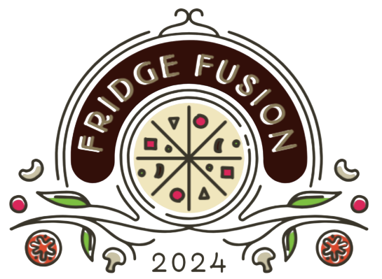
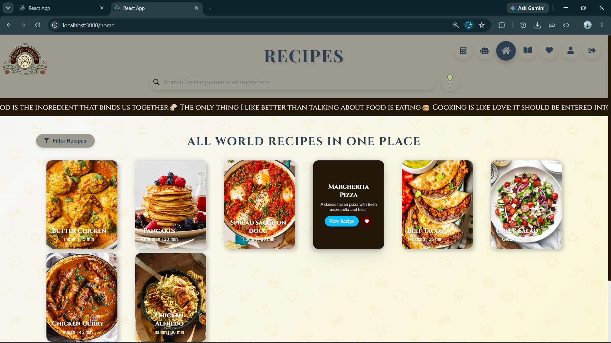
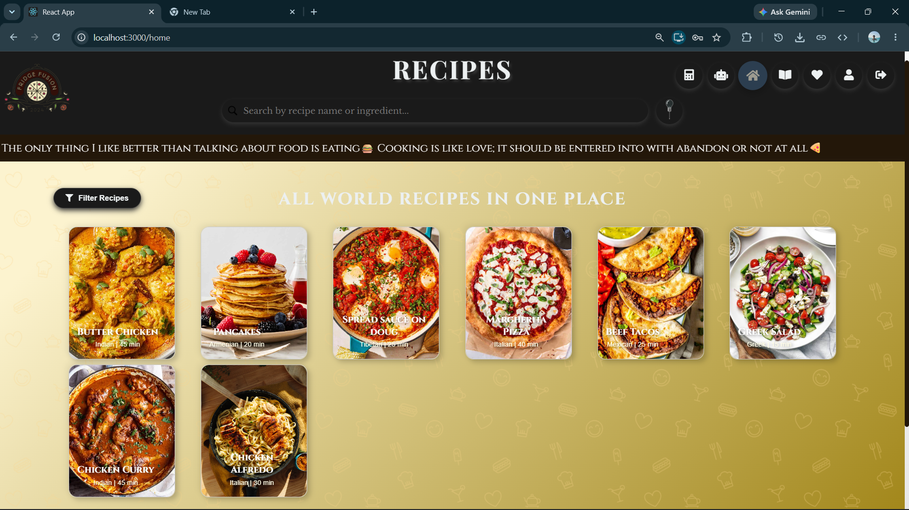
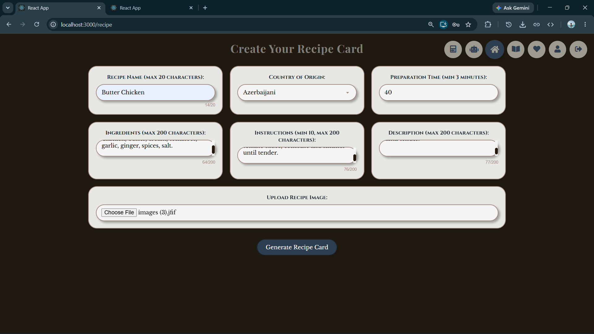
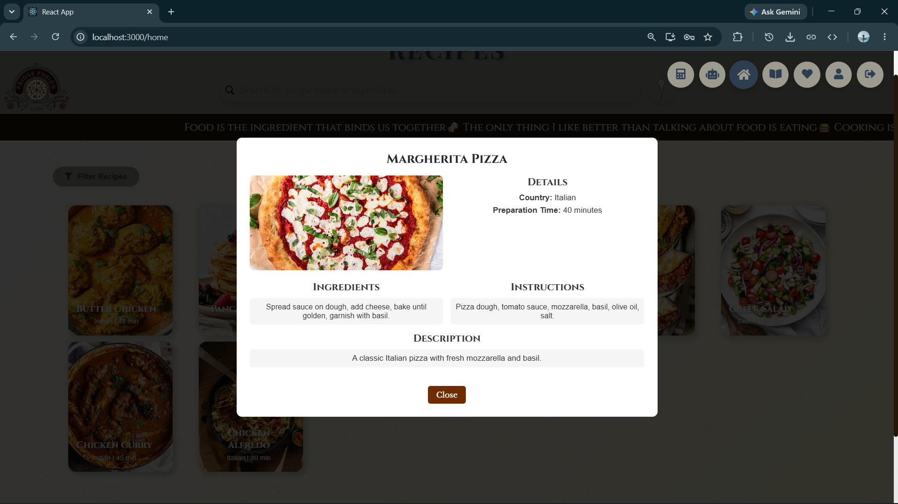
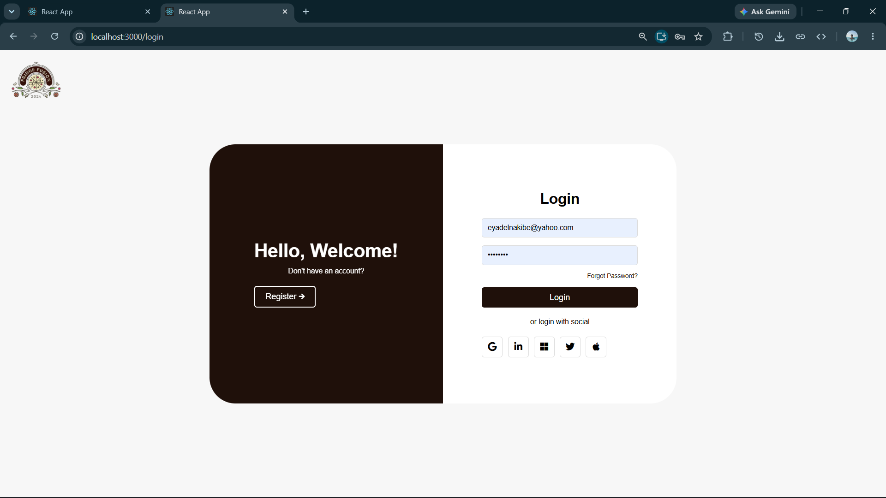
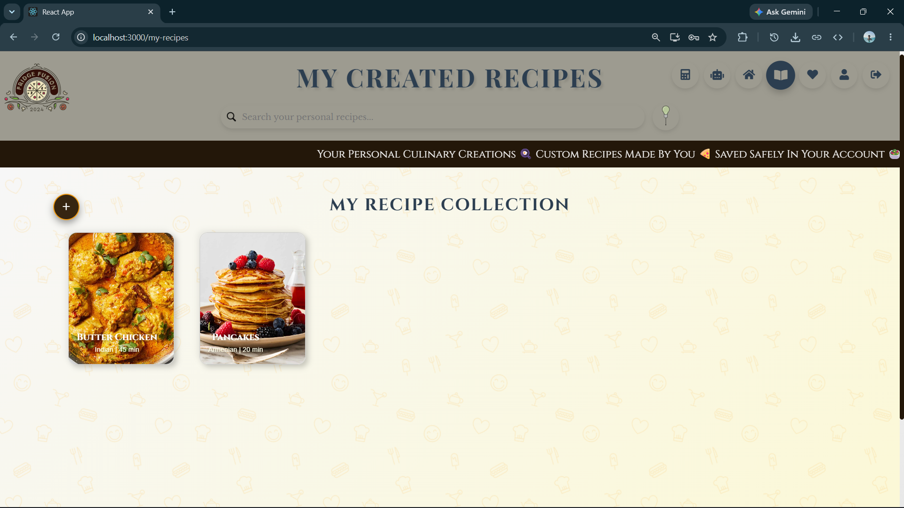
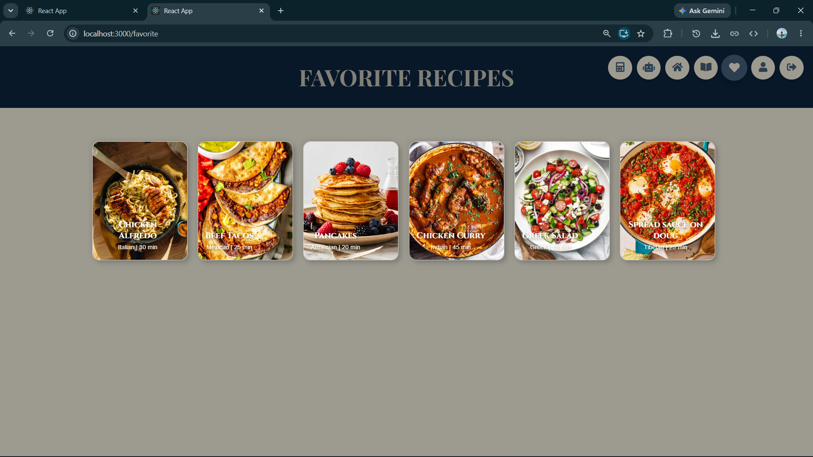
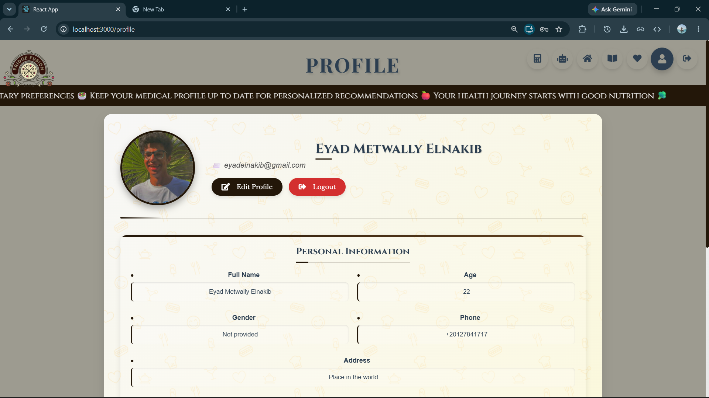
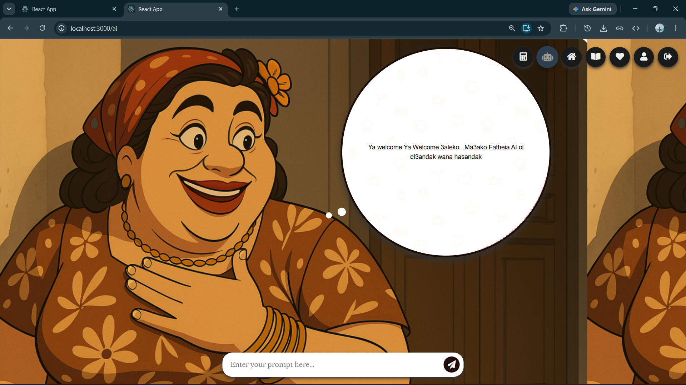

<div align="center">



# 🍽️ Fridge Fusion

**The Global Food Community Platform & AI Chef Assistant**

[](https://reactjs.org/)
[](https://nodejs.org/)
[](https://expressjs.com/)
[](https://www.mongodb.com/)
[](https://groq.com/)

</div>

---

## 🎯 Executive Summary

**Fridge Fusion** is an all-in-one digital platform created for the **global food community**. It brings together everything related to food under one roof: global community recipe discovery, smart ingredient-based AI cooking assistance, personal cookbook management, health and calorie calculations, and recipe creation.

### The Problem It Solves
1. **Daily Meal Dilemmas**: People frequently ask *"What should I cook with the ingredients left in my fridge?"*
2. **Food Waste**: Billions of tons of fresh ingredients are thrown away annually due to lack of recipe inspiration for leftovers.
3. **Fragmented Tools**: Food lovers currently have to use separate apps for recipes, AI help, macro tracking, and personal cookbooks.

---

## 📸 Interactive Feature Showcase

| 🌍 World Recipe Library (Light) | 🌙 World Recipe Library (Dark) |
| :---: | :---: |
|  |  |
| **Real-time filtering & Multi-Criteria Search** | **Native CSS Variable Theme Switching** |

| 📝 Recipe Card Generator | 🃏 Interactive 3D Recipe Cards |
| :---: | :---: |
|  |  |
| **HTML5 FileReader Image Processing** | **CSS Grid Layouts & 3D Flip Animations** |

| 🔐 Secure JWT Login System | 📖 Personal Cookbook (My Recipes) |
| :---: | :---: |
|  |  |
| **Stateless Authentication with Bcrypt Hashing** | **Manage & Delete User-Generated Recipes** |

| ❤️ Favorites Collection | 👤 User Profile Dashboard |
| :---: | :---: |
|  |  |
| **Client-Synced Saved Recipes Hub** | **Avatar Uploads & Bio Management via Multer** |

| 👩‍🍳 Fatheia AI Chef Assistant |
| :---: |
|  |
| **Powered by Groq Llama-3.3-70B** |

---

## 🏗️ System Architecture

Fridge Fusion is architected as a robust MERN-stack monorepo integrating seamless AI orchestration. 

<details>
<summary><b>View Detailed Architecture Breakdown</b></summary>

### 1. Client Layer (React.js)
* **Single Page Application**: React 18 & React Router v6.
* **Styling**: Vanilla CSS3 Custom Design System (CSS Variables for Dark/Light Theme Switching, Glassmorphic overlays, 3D Card Flips).
* **State & Sync**: Axios HTTP Client for robust API communication.

### 2. Async API Gateway (Node.js & Express)
* **Security & Auth**: JSON Web Tokens (JWT) for stateless authentication and Bcrypt.js for salt-based password hashing.
* **File Uploads**: Multer middleware processing profile avatars and recipe images (`/uploads`).
* **AI Orchestration**: Groq API integration using `llama-3.3-70b-versatile` optimized for sub-2-second latency.

### 3. Database Layer (MongoDB)
* **Mongoose ODM**: Strongly typed data schemas for Users and Recipes.
* **Fallback Strategy**: Automatic fallback to an embedded `MongoMemoryServer` if local MongoDB is unavailable.

</details>

---

## 🧩 Module-by-Module Feature Breakdown

<details>
<summary><b>1. Authentication & Navigation</b></summary>

* **Landing Hub (`/`)**: Welcomes users with a showcase banner, dark/light toggle, and global navigation.
* **Auth System (`/login`, `/signup`)**: JWT-based registration, login, and a development mock email reset system.
</details>

<details>
<summary><b>2. Community & Private Recipes</b></summary>

* **World Library (`/home`)**: Real-time filtering by country, preparation time, and main ingredient. Click any 3D card to preview or view full instructions.
* **Personal Cookbook (`/my-recipes`)**: Private management of user-created recipes with CRUD operations.
* **Recipe Generator (`/recipe`)**: Interactive studio to create and publish custom recipe cards.
* **Favorites (`/favorite`)**: Saved recipes hub synced across client views.
</details>

<details>
<summary><b>3. AI & Health Utilities</b></summary>

* **Fatheia AI Chef (`/ai`)**: A strict food-only conversational AI assistant powered by Groq, providing step-by-step instructions.
* **Calorie & BMR Calculator (`/calories`)**: Uses the Mifflin-St Jeor Equation for BMR, TDEE, fitness goal targets, and macro ratios.
</details>

---

## ⚙️ Developer Setup & Environment Guide

### 1. Prerequisites
| Requirement | Minimum | Notes |
|---|---|---|
| **Node.js** | v16+ / v18+ | JavaScript runtime |
| **npm** | v8+ | Package manager |
| **MongoDB** | local or atlas | (Falls back to Memory Server if unavailable) |

### 2. Environment Configuration
Create a `.env` file in `backend/.env` based on `.env.example`:
```env
PORT=5000
MONGODB_URI=mongodb://localhost:27017/fridge-fusion
JWT_SECRET=your_jwt_secret_key_here
GROQ_API_KEY=gsk_your_groq_api_key
```

### 3. Quick Start (Monorepo)
```bash
# Install dependencies for both frontend and backend
npm run install:all

# Start both servers concurrently
npm start
```
* **Backend**: `http://localhost:5000`
* **Frontend**: `http://localhost:3000`

---
*Architected and engineered for the global food community.*
